# Git  tryouts

### Commands to have on finger tips when working with Git
Git commands at once.
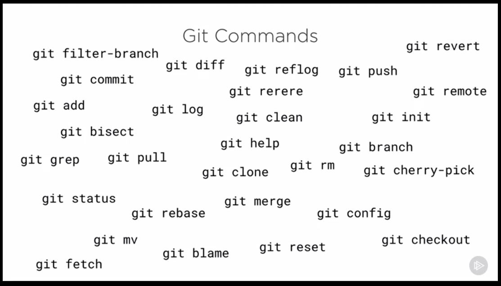
Git maintains four different areas to function as a DVCS.
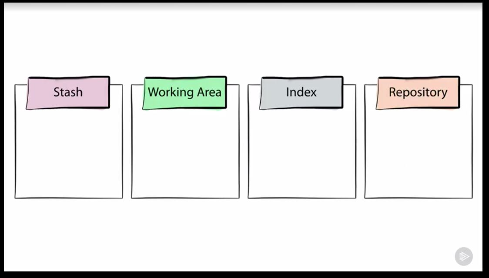

>The documentation of the Git internal working is documented in this [how_git_works.md](./how_git_works.md) file by the learnings of pluralsight course "How Git Works".

1.To discard the changes made to a tracked file before staging it for the new commit.
Resetting the changes to a file.

    git reset --hard 
This will move the data from repository to working area and index area, but if want to reset only one file , the intuitive command "git reset --hard <filename>" will not work here.
Here we have to use checkout. 

    git checkout <filename> ( This will move the data of the given file from repository to index area and working area).
    
> NOTE: The "checkout" for a file is a very destructive command and must be used with utmost care as it reverses the changes made to a file completely without any warning and the changes once reversed cannot be recovered.

	git checkout file.txt
	
2.To unstage the file and keep the changes made to the file.

	git reset HEAD fil1.txt

3.To uncommit the commit that was done but keeping the changes of the commit in the stage ( hence you add more changes to the files ). The commit to which you reset to , all the other commts after the that commit and their changes will be editable and all the commits changes can be squashed together along with new changes.

     git reset --soft HEAD~1
     
4. To uncommit the commit made and discard whatever changes done to the files in that commit.

    git reset --hard HEAD~1
    
5.To clear the unstaged files from the git ( For examples target folder and config and log files)

    git clean -n  ==> will give you "what would you do ?"
    git clean -f ==> will force to remove the files from git (But will be there in the folder)
    
6.To tag the commit. This is tag will always point to the same commit always no matter what.

    git tag mytag
    or
    git tag -a mytag ( This will provide you to give the message for the tag)
	
To sign the tag use -s switch and to verify that use the -v switch

    git tag -s mysignedtag (Asks for the passphrase to be signed).
    git tag -v mysignedtag (To verify the signed tag).
    
To push the tags (which doesn't happen with just git push)

    git push --tags
To create a branch from a tag 

    git branch <new-branch> <tag-name>

7.Configuring the logs with aliases

    git log --graph --oneline --all --decorate ( This will give the commit in a nice decorated concise format)
    git config --global alias.lga "log --graph --oneline --all --decorate" (To make and alias lga)
    git lga (to use the alias created , the alias can be found in the .git/gitconfig file)
    
8.Once the branch has been deleted the changes or the commits can still be recoered and make those commits into a new branch

    git reflog ( Gives all the references to which the HEAD has pointed to).
    git branch <new-name-for-deleted-branch-commit> COMMIT-SHA (This will create the new-branch with the same commit of the deleted branch)
    
**Note: These HEAD references which are dangling commits will be maintained by GIT for 30 days only.**

9.Stashing the changes. This will save the changes to the Stash area.

    git stash (Stashes the changes)
    git stash list (to list the stashes)
    git stash apply (to apply the changes , but the stash will be there in the stash list)
    git stash pop ( the stash will be applied but will be removed from the stash list)
    git stash branch <branch-nanme> ( to make the stashed changes into a new branch)
    git stash clear (to clean the stash area)

Stash workflow:   
The stash command will copy the changes from the Index by default and you can also stash the files in the working area by using the "--include-untracked" option , it moves the data to Stash area and moves the data from Repository area to Index and working directory.

    git stash --include-untracked (will stash the untracked files from the workind area and also the tracked files from the index area)
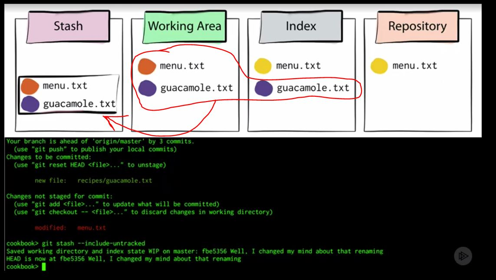
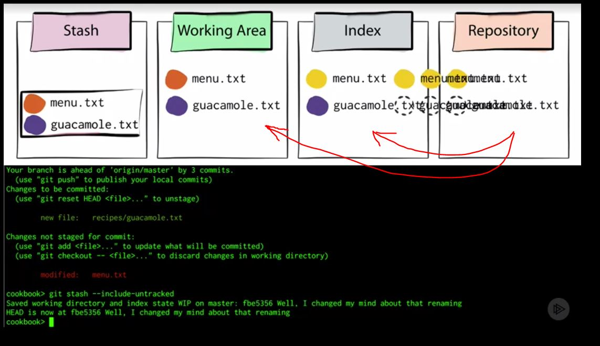
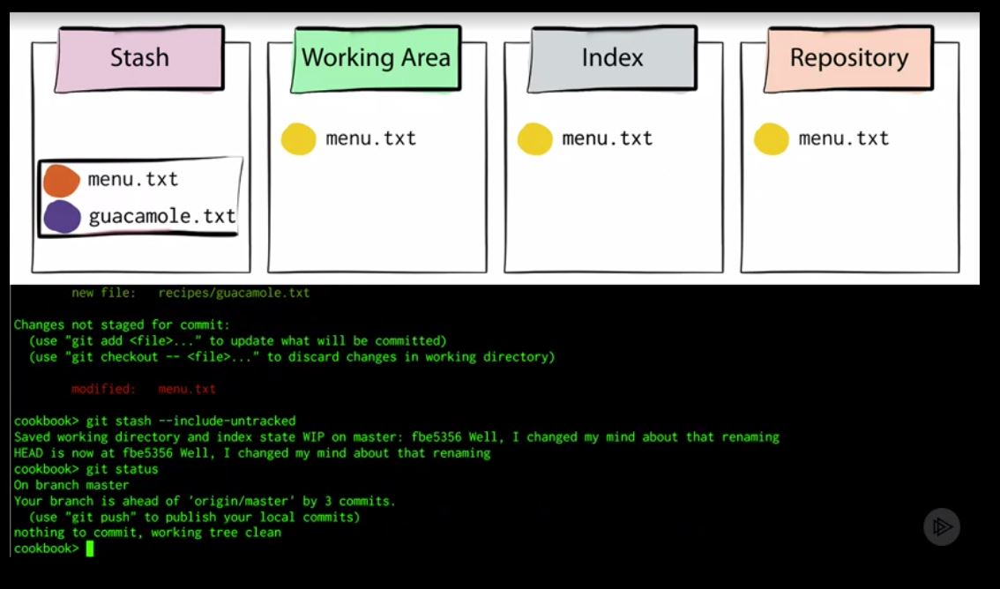

Applying the stashes back . You can mention which stash you want to apply or else by default the latest stash will be applied.
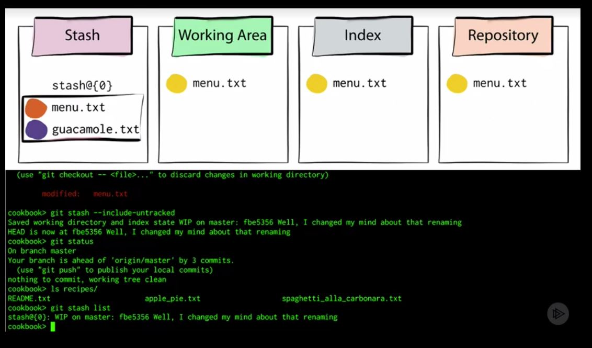
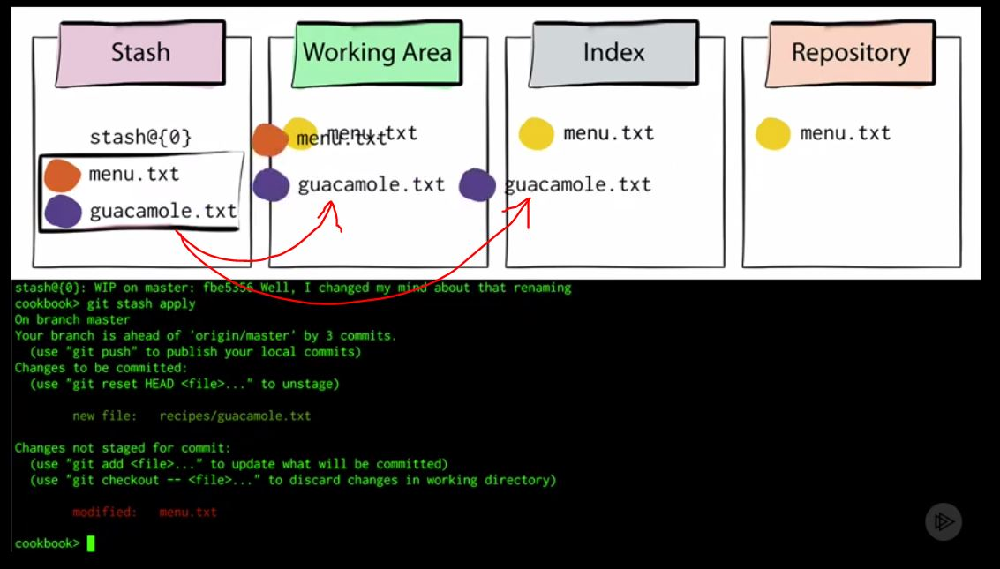

    
10.Difference between the staging aread and the repository. The changes are added to the staging area and it gives the diff with respect to the repository (HEAD)

    git diff --cached
    
Finding difference between the current commit and the previous commit.

    git diff HEAD HEAD~2
Finding the difference between two branches.

    git diff branchone branchtwo
    
    
11.Rebasing -- Its all about applying the commits of one branch to another branch. The commits that have been done to one branch and you want those commits in your branch (In other words one branch is ahead of another branch and you want the lagging branch to catch up with the branch with new commits) 
Assume you are in one of the feature branch and it is behind the master and you want the commits of the master so the feature branch can move ahead of the master branch and you can continue to do the work of feature branch or you can merge the branch to master itself.

    git rebase master ( This will add the commits from master to the current active branch.)

Here the  master branch can be ahead or behind a feature branch. If the master branch is behind and all the commits of the master branch is already present in the feature then there is no need of rebasing and rebasing will shout the feature branch is uptodate with master branch, in case the master branch has any other commits which are missing by the feature branch then the commits will be added to the feature branch and master will remain same. If the master branch is ahead of the feature branch then the feature branch will apply all the commits from the master branch and comes head to head with the master branch , if the new commits are present in the feature branch which are made before rebasing then these will be kept with the branch in additional to the commits of the master (i.e., the commits of the master will be added to the feature branch and the new commits that were made to the feature branch will be kept in feature branch.).
In case of conflicts the rebasing will stop and ask for you to resolve the conflicts and then you can continue the rebasing process , the merge conflict resolved files must be staged and then only you can continue the rebasing.

    git rebase --continue
    
> Rebase will change the order of the history of the commits , so it always good thing to avoid the rebasing and prefer to use merge.
##### Golden Rule is never use rebasing in a shared repository which wll change the history of commit (Even by chance if the commits are in same order still the commits are newly created objects and the conflicts will erupt).

12.Cherry picking -- It will allow you to particularly apply one commit from one branch to another ( why only one commit ?? -- That is how you should group the changes to a commit and then make the commit as a individual change like a fix or a patch or a feature . The rebasing or merging will take all the commits to the branch and that is not what is required here only one commit , a fix , a single file change or file added can be taken from one branch to another)
From the branch in where you want the cherry pick to , run the cherry pic command

    git cherry-pick <COMMIT_FROM_OTHER_BRANCH>
    
    
If the branch from which the commit was taken is merged to the branch to which the commit was applied then the Git will not apply the same commit again (GIT is smart enough to know that commit was alredy taken from that branch) 

13.Adding the remote branches from the local branches

    git push origin new-branch (This will push the whole branch commits to the remote repository , it will create the new branch if it is not present in remote repository).
    
14.Deleting remote branches is corky.

    git push origin localbranch:remote-branch ( This will create another branch as remote-branch from the local branch localbranch)
    
    git push origin :fe1branch ( This will DELETE  the branch fe1branch in the remote repository and the local branch is not mentioned here)
    
15.Diff  will give the difference between two areas among three(Working area , Index area ( Staging area ) and Repository).

    git diff 
The above command will give the difference between the Working directory and Index(Staging area).

    git diff --cached 
The above command will show you the difference between the Staging area and the Repository.

16.Removing a file from the staging area (Index area).
        
    git rm <filename_which_has_staged> (This will remove the file from the index area and the working area , i.e., it will permanentlty delete the file)
    git rm --cached <filename_which_has_staged> ( This will remove the file from the Staging area and NOT the working direcotry, so the file will be unstaged and will be listed under untracked files).
    
17.Reset  -- It is the special command to move the branch ( the branch pointers  pointing to commits ).
It moves the current branch, and optionally copies data from the Repository to the other areas.

    git reset --hard <commit> ( This will move the data from Repository to both working area and the Staging area)
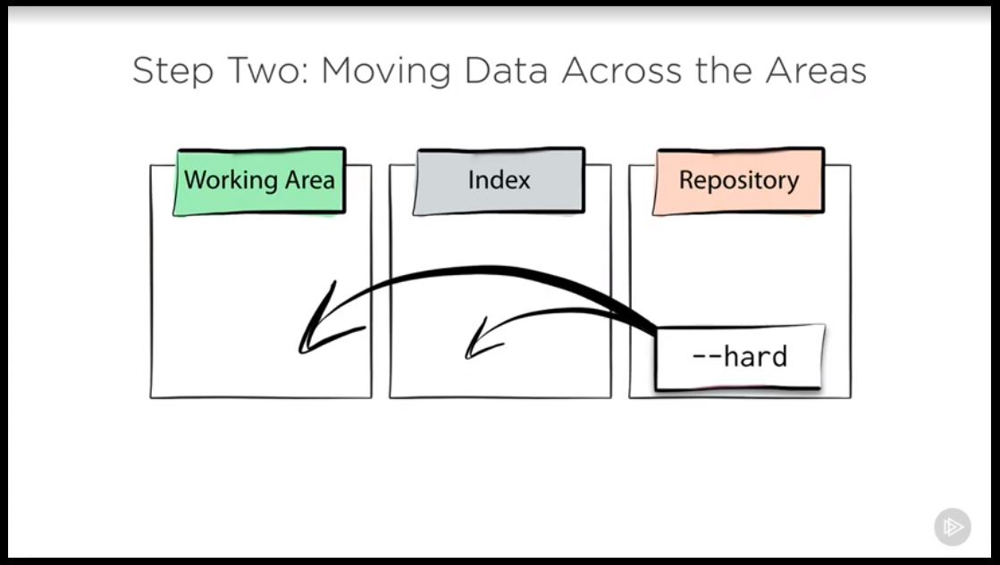

    git reset --mixed <commit> ( This will move the data from the Repository to only Index area. THIS IS THE DEFAULT OPTION (git reset )).
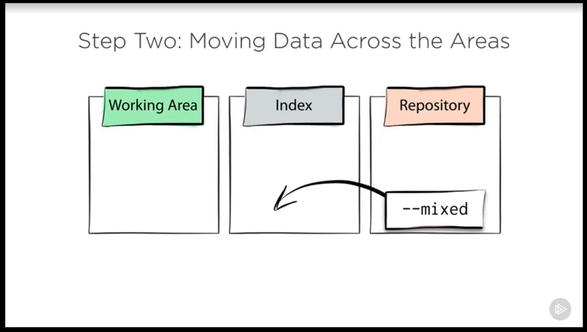

    git reset --soft <commit> ( This will NOT move the data to any of the areas , it just moves the branch reference)
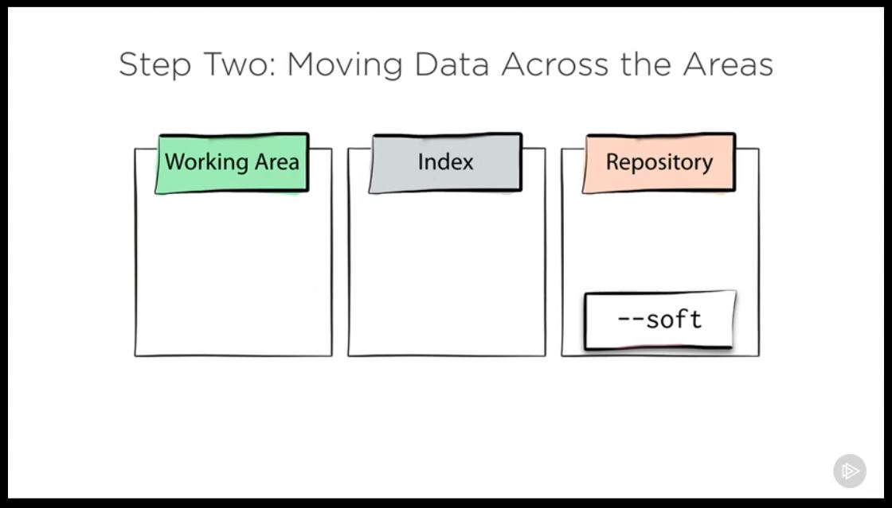

18. Logs : seeing the commits 

    git log --graph --decorate --oneline --all 

|Switches|Use|
|:---:|:---:|
|graph| Presents the commits in a graph representation and makes it easy to understand the branching of the different branches|
|decorate| Adds the labels such as HEAD,Tags, Branch names and remote branch names to the commits|
|oneline| Shows only the commit message for a commit in the logs|
|all| shows the commits of all the branchs|

To show the commit information , the following command can be used 

    git show <commit-hash/branch-name/HEAD> (If the branch-name is given the latest commit information is shown).

19. Head references. To refer a commit with respect to HEAD reference, there are two ways one is using the ^ and other using ~(number).
Ex: To refer the commit which is 3rd commit previous to the HEAD , it can be referenced as below

    git show HEAD^^^
    git show HEAD~3
    
And if there are two parent commits for a commit and you want to refer that you can do it like this.

    git show HEAD~2^2 (Two previous commit's second parent)
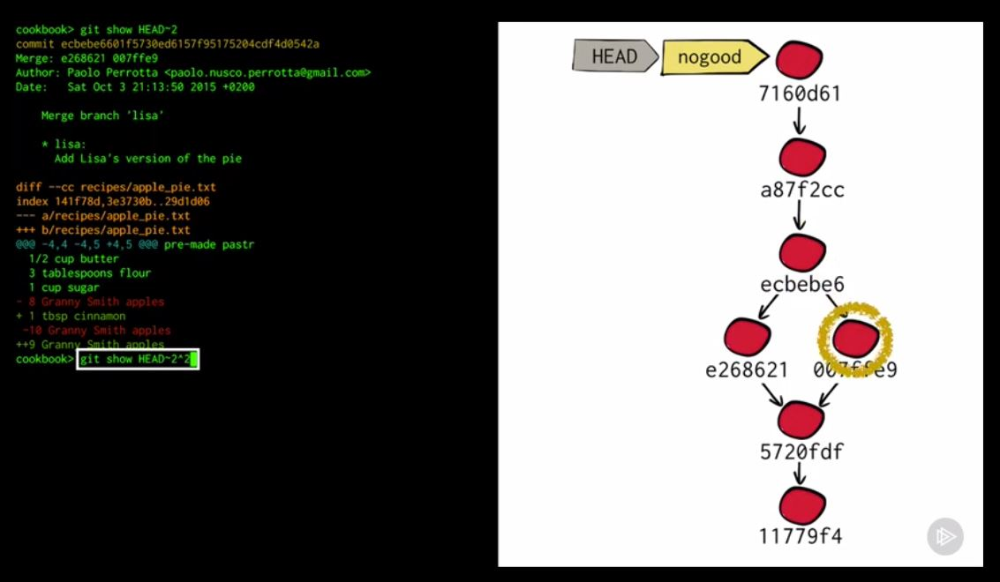
You can also check for the HEAD position at a particular time.
Ex: Position of the HEAD pointer a month ago.

    git show HEAD@{"1 month ago"}
    
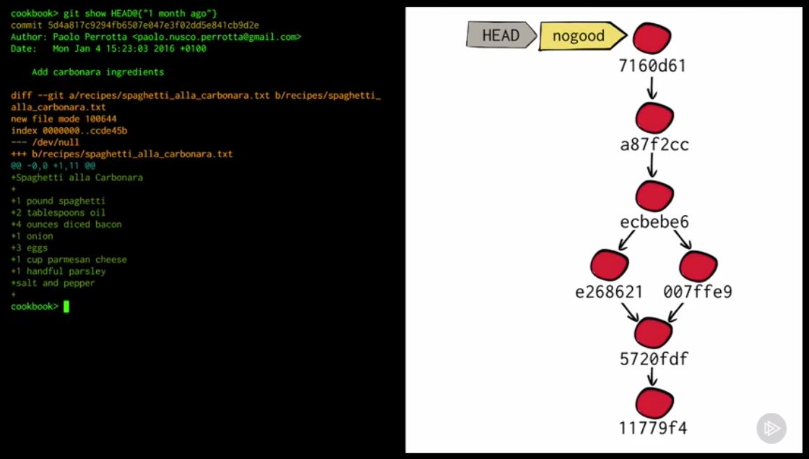
    
20.Blame - It will give you the line by line list of which commit is added the that line in the file.

    git blame <filename> ( The ^ symbol represents the first ever commit  , which means the commit that added the file to the repository)

21.Checking the logs -- "git log" is the most powerfull command that you can use for the checking the history.
Few examples for using the log command with its flexible power.

    git log --patch (shows which lines are added in the commit)
    git log --grep <text> --oneline (Gives the commits with the <text> in the "message" of the commit )
    git log -Gapples (Gives the commits in which the file was added or deleted with "apples" text.)
To show the range of commits.

    git log -3 (gives the latest 3 commits)
    git log HEAD~5..HEAD (Commits from 5 commits previous to HEAD to current HEAD).
> NOTE: The `git log HEAD~5..HEAD` command the range is specified from the older commit to new commit. The order in this output is reversed with respect `git log` command.

Comparing the logs of two branches .

    git log <merging_into_branch>..<to_be_merged_branch>
    git log master..b1 (This can be read as .. go from master branch to b1  branch and list all the commits that you find.).
In the above command if the b1 branch is merged to master branch then the listed commits of the above command are merged to the b1 branch. 
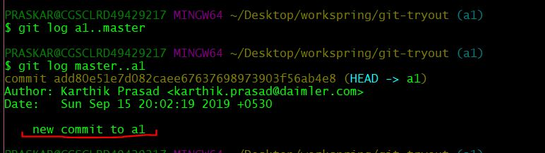

> NOTE : This is completely different from `diff` command as diff compares the content of the files and log will give the commits.

22.Chaning the commit message of the latest commit.

    git commit --amend (you can change the message of the latest commit).
##### Never change the shared commit (the commit which has been already pushed to remote).

To change the commit which is much older than the current commit rebase can be used with -i switch.

    git rebase -i <reference/commit-hash/branch> (All the past commits from the given reference will be enabled for the editing in the interactive reabsing.).
    
In the rebasing you are empowered to change the commit order , squashing two or more commits to one commit (The new message for the commit will be asked during the rebasing process)  and changing the commit messages. If squash is used then the commit that is prefixed with squash will be squashed to the previous commit that was applied during the rebasing process.
> During interactive rebasing the commits are applied one by one , hence if a commit has been done by resolving the merge conflicts then during the rebasing the same conflicts will emerge and they need to be resolved once again. It is more like applying the commits again to your repositroy.

_**Interactive rebasing is very powerfull and can be used to cleanup the history of commits before pushing to the remote or to production.**_

23.Revert -- It reverts a particular commit - it creates a whole new commit with exactly the opposite of the changes of the given commit.
If the reverted commit added any lines or any files then reverting will create a new commit by removing those lines or files and that new commit will be the latest commit  in the history.

    git revert <commit-hash>
    
> Reverting a Merge commit will come with a lot of conflicts and it should be handeled very carefully.
**Revert is NOT and Undo operation , it creates a whole new commit with opposite changes from a specified commit**

